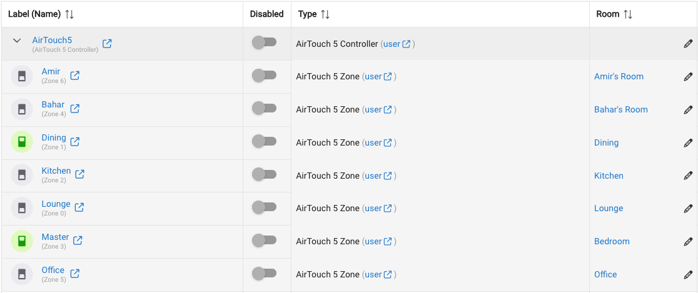

# Hubitat Driver for Airtouch 5 AC Controllers

A custom Hubitat Elevation driver for monitoring and controlling your **Airtouch 5** AC Controller directly from your home automation platform.

Full disclosure, I used Claude to write this based on the [API Specification](AirTouch5_Communication_ProtocolV1.1.pdf). Included is a `CLAUDE.md`
file that will help anyone improve on this plugin and pickup where Claude left off. PR's are welcome :)

## Features

- Connects to your Airtouch 5 Controller via TCP
- Monitors temperature, fan speed, mode, set temp
- Queries for all Zones and creates sub-devices for each

### Controller Device

States:
- Ac Fan Speed
- Ac Mode
- Connection Status
- Console Version
- Power State
- Setpoint
- Switch

Capabilities
- Initialize
- Refresh
- Switch
- TemperatureMeasurement

### Zone Device

States:
- Control Method
- Open Percentage
- Setpoint
- Switch
- Temperature
- Zone Name

Capabilities:
- Switch
- TemperatureMeasurement

## Installation

1. In Hubitat → Drivers Code, click the "+ Add driver" button and paste contents of `AirTouch5.groovy` and click Save
2. Add another driver and paste contents of `AirTouch5Zone.groovy` and click Save
3. In the Devices section, create a new Virtual Device, choose driver AirTouch 5 Controller
4. After creation, in your new device's preferences, set the static IP of the AirTouch 5 console and the AC unit number (0 for single-AC setups)
5. Click Save Preferences → the driver connects, polls status, and auto-creates Zone child devices.
6. Check the state of the device, the "Connection Status" should be "connected" if the IP was correct
7. You may need to wait 5 minutes for the Zones to be sync'd with their current state and label

## Caveats

- This is only written and tested for a single AC unit. For multi unit setups, you will need to modify the code.
